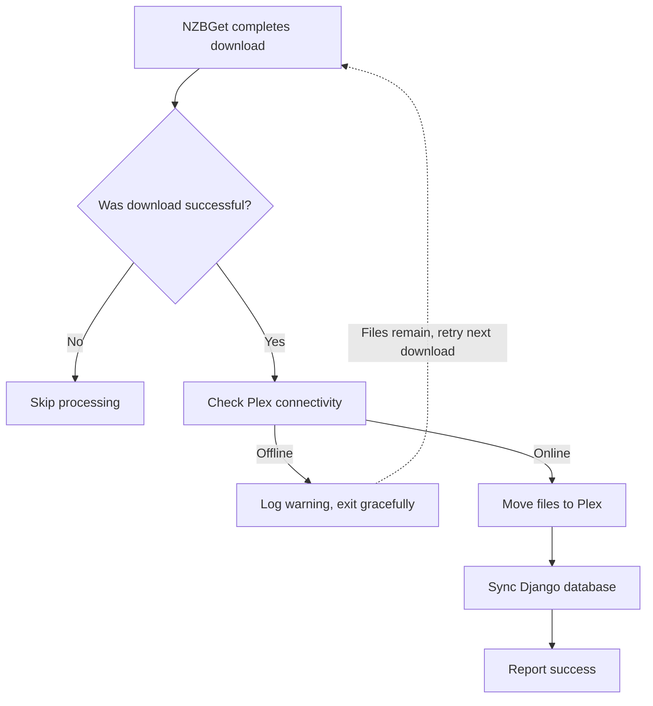

# NZBGet Post-Processing Setup Guide

This guide walks you through setting up automatic processing when NZBGet completes downloads.

## Prerequisites

✅ NZBGet installed and configured  
✅ Plex server running on your NAS  
✅ Django project set up with required environment variables  

## Step-by-Step Setup

### Step 1: Locate NZBGet Scripts Directory

Open NZBGet web interface and check where scripts are stored:

1. Go to **Settings** → **Paths**
2. Find **ScriptDir** (e.g., `C:\ProgramData\NZBGet\scripts`)
3. Note this path - you'll need it

### Step 2: Copy the Post-Processing Script

```powershell
# Copy the script to NZBGet's scripts directory
Copy-Item "C:\Users\Nick\nstv\scripts\nzbget_postprocess.py" `
          "C:\ProgramData\NZBGet\scripts\nzbget_postprocess.py"
```

Or manually:
1. Navigate to `C:\Users\Nick\nstv\scripts\`
2. Copy `nzbget_postprocess.py`
3. Paste into NZBGet's scripts directory

### Step 3: Configure the Script in NZBGet

1. Open **NZBGet web interface**
2. Go to **Settings**
3. Scroll to **Extension Scripts** section
4. Find **Auto-process downloads to Plex**
5. Configure these parameters:

   **NSTV_PROJECT_PATH**:
   ```
   C:\Users\Nick\nstv
   ```

   **PYTHON_PATH** (Optional - use full path to your Python):
   ```
   C:\Users\Nick\nstv\.venv\Scripts\python.exe
   ```
   Or leave empty to use system Python

   **MEDIA_TYPE**:
   ```
   all
   ```
   (Options: `tv`, `movies`, or `all`)

   **VERBOSE**:
   ```
   yes
   ```
   (Recommended for initial testing)

6. **Save changes** and **Reload NZBGet**

### Step 4: Enable the Script for Categories

1. Still in **Settings** → **Categories**
2. For each download category (TV, Movies, etc.):
   - Find **Extensions** field
   - Add: `nzbget_postprocess.py`
   - Or use `*` to run for all categories

3. **Save and Reload**

### Step 5: Test the Integration

1. **Download a small test file** via your web UI
2. **Watch NZBGet Messages** tab during download
3. **After completion**, you should see:
   ```
   [INFO] Processing completed download: Your.Show.Name
   [INFO] Checking Plex server connection...
   [SUCCESS] ✓ Plex server "AS6602T-8263" is accessible
   [INFO] Processing TV Shows
   [SUCCESS] Post-processing completed successfully
   ```

4. **Verify** the file moved to Plex directory
5. **Check Django database** to confirm episode/movie was added

## What Happens When It Runs



## Troubleshooting

### Script doesn't show up in NZBGet

- **Check file permissions**: Script must be readable
- **Reload NZBGet**: Settings → System → Reload
- **Check logs**: NZBGet Messages tab for errors

### Script runs but nothing happens

Check the script output in NZBGet Messages:

**If you see "Plex server is not accessible":**
- Verify Plex is running
- Check environment variables are set
- Files will be processed on next successful download

**If you see "Permission denied":**
- Run NZBGet with appropriate permissions
- Check write permissions on Plex directories

**If you see "Module not found":**
- Verify PYTHON_PATH points to virtual environment Python
- Or activate venv before starting NZBGet service

### Verify Environment Variables

In the script configuration, check these are set in your environment:
```powershell
$env:NZBGET_COMPLETE_DIR
$env:PLEX_TV_SHOW_DIR
$env:PLEX_MOVIES_DIR
$env:PLEX_EMAIL
$env:PLEX_API_KEY
$env:PLEX_SERVER
```

### Test Script Manually

You can test the script outside NZBGet:

```powershell
cd C:\Users\Nick\nstv
.\.venv\Scripts\python.exe manage.py process_downloads --dry-run --verbose
```

## Advanced Configuration

### Process Only Specific Media Types

Set **MEDIA_TYPE** to:
- `tv` - Only process TV shows
- `movies` - Only process movies  
- `all` - Process everything (default)

### Category-Based Processing

You can configure different scripts for different categories:

**TV Shows Category:**
- Extensions: `nzbget_postprocess.py`
- MEDIA_TYPE: `tv`

**Movies Category:**
- Extensions: `nzbget_postprocess.py`
- MEDIA_TYPE: `movies`

### Disable Verbose Output

Once you've confirmed it's working:
- Set **VERBOSE** to `no`
- Reduces log clutter in NZBGet Messages

## Safety Features

✅ **Plex Health Check** - Won't process if Plex is offline  
✅ **Graceful Failures** - Files remain if processing fails  
✅ **NZBGet Success Codes** - Returns proper status codes  
✅ **Timeout Protection** - Aborts if processing takes >10 minutes  
✅ **Non-Destructive** - Original files only moved after validation  

## Disabling the Integration

If you need to disable automation:

1. Go to **Settings** → **Extension Scripts**
2. Find **Auto-process downloads to Plex**
3. Uncheck **Enabled**
4. Save and Reload

Or remove from category Extensions fields.

**Your manual web UI buttons still work!**

## Next Steps

Once confirmed working:
- Monitor for a few days to ensure stability
- Consider Task Scheduler as backup automation
- Reduce VERBOSE if logs get cluttered
- Enjoy hands-free media management! 🎉
